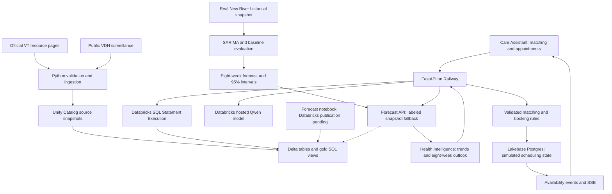

# HokieCare

**Find care today. Understand the health trends ahead.**

HokieCare has two central parts: **Care Assistant**, which helps students navigate services and coordinate appointments, and **Health Intelligence**, which turns regional public-health history into an eight-week respiratory outlook. Together, they connect the immediate task of finding care with a forward-looking view of respiratory activity in the surrounding community.

| Product pillar | What it does | Who it helps |
| --- | --- | --- |
| **1. Care Assistant — find and coordinate care** | Match a student's needs and schedule to relevant services, compare times, confirm a reservation, and manage cancellations or exact-time waitlists. | Students navigating campus and nearby care options. |
| **2. Health Intelligence — understand what may come next** | Explore real respiratory trends and an **eight-week forecast**, with uncertainty bands and baseline comparisons, then prepare a sourced briefing. | Healthcare professionals and campus planners exploring regional conditions that may inform preparedness discussions. |

Built at **VTHacks 14** for the **Deloitte × Databricks** student experience and **Impiricus** healthcare-professional engagement challenges.

**[Open the live demo](https://vthacks-2026-production.up.railway.app)** · [Implementation evidence](docs/HANDOFF.md) · [Run locally](#run-locally)

> This is a working, independently developed hackathon prototype, not an official Virginia Tech service. Public health data and cited resource information are real. Appointment inventory and reservations simulate people creating and having appointments; they do not book care with actual providers.

## Why we built it

Finding care involves more than finding a provider's name. A student must understand which service fits, check eligibility and scheduling rules, navigate the relevant portal or phone process, and find a time that fits their life. HokieCare aims to make that journey easier while keeping the student in control.

VT's own reporting illustrates why access and coordination matter:

| Historical evidence | What it tells us |
| --- | --- |
| **4,349 clients and more than 25,000 Cook counseling sessions in 2017–2018** | Campus counseling already supported substantial demand. |
| **43% growth in students seeking Cook services from 2013–2014 to 2017–2018**, compared with **9.5% enrollment growth** | Service use grew faster than the student population. |
| Initial intake waits of **up to three weeks during fall semesters**, and **34% dissatisfaction with long waits** in the cited Healthy Minds Study responses | Access delays were a documented historical concern. |

These figures come from the **[March 2019 VT Mental Health Task Force report](https://students.vt.edu/content/students_vt_edu/en/about/reports/_jcr_content/content/vtcontainer_234021403/vtcontainer-content/download_1936365224/file.res/Mental%20Health%20Task%20Force%20Recommendation%20Report.pdf)**, printed pages 13 and 19. They motivate the project; they are not measurements of today's queues.

There has also been progress: VT's **[2024–2025 Student Affairs annual report](https://students.vt.edu/content/students_vt_edu/en/about/_jcr_content/nav-briefs/vtmultitab/vt-items_0/vtcontainer/vtcontainer-content/download_1364104811/file.res/2024-2025%20Annual%20Report.pdf)**, printed page 6, reports reduced waits between triage, intake, and the first counseling appointment, with an average **7.7 Cook sessions versus 5.7 nationally**. Our case for HokieCare builds on that progress. We have not measured current VT wait times or a reduction caused by our prototype.

### The navigation problem today

Students encounter different entry points and service rules. [Cook publishes a phone-based scheduling process](https://ucc.vt.edu/appointment.html), [Schiffert directs students to the Healthy Hokies Portal or phone](https://healthcenter.vt.edu/appointments.html), and [TimelyCare distinguishes scheduled counseling from on-demand TalkNow](https://ucc.vt.edu/timelycare.html). Cook individual therapy and TimelyCare scheduled therapy also have a concurrent-use restriction. Students must understand those differences before scheduling.

Our design addresses that navigation burden with one guided request, sourced explanations, comparable calendar choices, and an exact-time waitlist. The five-center appointment experience covers **Schiffert, Cook, TimelyCare, Carilion, and Hokie Wellness**. It demonstrates how coordination could work across those providers; their scheduling systems are not connected to our app.

### The need for a forward-looking health picture

Coordinating individual appointments addresses one part of access. Providers and campus planners also need a clear way to understand how respiratory activity is changing around them. Historical charts establish what has happened; an outlook makes the possible direction and uncertainty of the coming weeks visible.

That is the purpose of HokieCare's second pillar, **Health Intelligence**. We use 350 weeks of real New River district observations to forecast the percentage of Emergency Department and Urgent Care visits associated with COVID-19, influenza, or RSV over the next eight weeks. The intended use is to support informed preparedness conversations. The regional percentage is not a count of future campus appointments, and the prototype does not make staffing decisions or issue outbreak alerts.

## Two core product experiences

### 1. Care Assistant: find and coordinate care

1. **Describe the request.** Guided intake collects a name or alias, support needs, preferred center and modality, student eligibility, and a date/time window.
2. **Find relevant services.** A Databricks-hosted language model interprets the request using sourced service context. Backend rules validate service fit, preferences, eligibility constraints, and dates.
3. **Choose a time.** Matching stored calendar slots appear chronologically, with more choices available on demand. The student chooses the time rather than having the first result automatically booked.
4. **Review and confirm.** A separate review shows the exact service and time. Only explicit confirmation writes the reservation, after another availability and ownership check.
5. **Manage the appointment.** A private agenda supports cancellation, rescheduling, and calendar export. Shared calendars show anonymous availability changes across browser sessions.
6. **Join an exact-time waitlist.** Taken times can be saved to My waitlist. A cancellation makes an offer available to waiting users; required intake and explicit confirmation still apply. Competing confirmations can produce only one successful reservation.

The backend also retains the conversational assistant API for grounded answers and booking actions. The current landing experience uses guided intake. TalkNow is an on-demand resource, not a reservable calendar service.

### 2. Health Intelligence: eight-week respiratory forecasting

The **Next 8 weeks** panel is the centerpiece of Health Intelligence. It brings a forward-looking regional respiratory outlook into the same product students use to navigate care.

1. **Explore the regional history.** Switch between Emergency Department and Urgent Care observations, review 350 weeks of trends, and inspect disease-specific charts and an accessible table.
2. **Look eight weeks ahead.** Summary tiles and a forecast chart show the projected combined respiratory-visit percentage and a **95% uncertainty band**.
3. **Inspect the evidence.** A computed outlook summary and baseline scorecard put the projection in context. Source dates and the data-mode badge distinguish a precomputed snapshot from a Databricks-served forecast.
4. **Prepare a briefing.** Review the evidence alongside relevant campus resources, then edit and export a sourced resource card. The card uses a deterministic template and is not automatically sent.

#### How the forecast works

The forecasting code fits **seasonal ARIMA (SARIMA)** models separately to the two facility series. It chooses among three fixed model candidates using only the first 320 training weeks, then evaluates one- through eight-week predictions across a **30-week holdout**, yielding 212 predictions per method per facility. Two simple baselines — last week's value and the same week last year — make the results interpretable. The selected model specification is refit on all 350 weeks to generate the eight-week outlook.

The feature is implemented through **`GET /api/forecast`**, a React/Recharts outlook panel, and a reproducible forecast notebook. The API attempts to read the Databricks forecast views and falls back to a **clearly labeled precomputed snapshot** generated locally from the real New River data. The notebook includes MLflow logging and Delta publication code; that Databricks execution has not yet been verified. The forecast feature is implemented, while automated publication and refresh remain a deployment milestone.

#### What the evaluation shows

| Facility | SARIMA MAE, 1–8 weeks | Same-week-last-year MAE | Interpretation |
| --- | --- | --- | --- |
| Emergency Department | 0.880 percentage points | **0.608 percentage points** | The seasonal baseline performed better. |
| Urgent Care | **1.836 percentage points** | 1.864 percentage points | SARIMA's advantage was small; it should not be treated as a decisive improvement. |

Last week's value performed best at the one-week horizon for both facilities. The holdout excludes a winter peak, and prediction intervals are wide. We show these results so users can judge the outlook's uncertainty. Forecasts describe **regional respiratory-visit percentages**, not individual illness, VT appointment demand, or no-shows. See [full methods, results, and limitations](docs/FORECAST_SUMMARY.md).

The two pillars complement each other: Care Assistant demonstrates how a person can reach an appropriate service, while Health Intelligence helps users explore the regional conditions around that care journey. Forecasts do not automatically change bookings or determine an individual's care.

### Official-provider handoff research

Official portal links remain available. An optional browser-companion preview was developed for Schiffert, and an authenticated feasibility test observed actual displayed availability. No real appointment was booked in that test. Installed-extension end-to-end booking and confirmed-provider-record import remain unfinished. See [companion documentation](companion/README.md) and [feasibility evidence](docs/SCHIFFERT_FEASIBILITY.md).

## Real data and simulated appointments

We built the public-data flow first, then added AI matching and persistent scheduling.

| Data | What we used | Role in the project |
| --- | --- | --- |
| VDH respiratory surveillance | **28,700 public aggregate records** in the imported snapshot | Real regional health evidence stored in Databricks. |
| New River subset | **700 observations: two facility series × 350 weeks**, January 4, 2020–September 12, 2026 | Trends, briefings, and forecasting. These are district observations, not VT student records. |
| Sourced resource directory | **Six curated records** with official URLs and verification metadata | Cook, TimelyCare scheduled counseling, TalkNow, Schiffert, Hokie Wellness, and SSD. This directory is distinct from the five-center scheduling catalog. |
| Academic scheduling simulation | Initial seed: **262 dates, 12,488 active slots, and 4,394 fictional reservations** for 250 synthetic owners | Simulates existing appointments and visitors creating, changing, or canceling appointments. These are seed-time counts, not current occupancy totals. |

**We used mock data to simulate real people creating and having appointments.** Fictional names and populated calendars let us demonstrate busy times, conflicting requests, cancellations, waitlist offers, and durable reservations without accessing private patient records. The application performs actual database transactions on that simulated inventory, and saved appointments survive application restarts.

Mock schedules and occupancy do not establish actual clinic hours, capacity, demand, no-show rates, or student behavior. The academic calendar provides a demonstration framework, not official provider closures. No reservation in HokieCare creates a real appointment at Schiffert, Cook, or another healthcare center.

The VDH snapshot retains **64 suppressed combined counts as null values with suppression flags**. We never turn those counts into zero or reconstruct them. Forecasting uses the published percentage series. Source geography, dates, and reuse caveats are retained in the [data feasibility notes](docs/HEALTHCARE_DATA_FEASIBILITY.md) and [import evidence](research/healthcare/databricks_import.json). The source is [VDH respiratory emergency-visit surveillance](https://www.vdh.virginia.gov/epidemiology/respiratory-diseases-in-virginia/data/emergency-visits-for-respiratory-illness/).

## Architecture



### Three implemented Databricks responsibilities

**1. Public data storage and analytics.** Python validates source records and writes immutable, hash-addressed snapshots to a project-owned Unity Catalog Volume and Delta tables in `workspace.hokiecare`. The `gold_service_directory` and `gold_new_river_trends` views serve the application through bounded backend queries. Provenance and suppression handling remain attached to the data.

**2. AI inference for navigation and matching.** We use the existing `databricks-qwen3-next-80b-a3b-instruct` hosted model rather than training a custom language model. It interprets requests and explains relevant services. Python validates model output against allowed services and retrieves actual stored demonstration slots. The model cannot invent valid slot IDs, execute arbitrary SQL, or directly commit appointments.

**3. Transactional appointment storage.** Databricks Lakebase Postgres stores sessions, slots, proposals, reservations, waitlist membership, and availability events. Transactions and interval-conflict checks protect against double booking and overlapping appointments. Idempotent requests make retries safe; rescheduling is atomic. Server-Sent Events, with polling recovery, refresh anonymous shared availability.

### Technology stack

| Layer | Technologies |
| --- | --- |
| Frontend | React, TypeScript, Vite, Tailwind CSS/custom CSS, Recharts, Lucide icons |
| API and application rules | Python 3.12, FastAPI, Pydantic, Uvicorn |
| Analytics and provenance | Databricks Unity Catalog, managed Volumes, Delta tables, SQL warehouse, Databricks Python SDK |
| Language model | Qwen3-Next-80B-A3B-Instruct through Databricks Model Serving |
| Scheduling persistence | Databricks Lakebase Postgres, Psycopg connection pooling; SQLite for local/test workflows |
| Health Intelligence forecasting | Python, statsmodels SARIMA, eight-week forecasts, uncertainty intervals, rolling evaluation, Recharts; notebook prepared for MLflow and Delta output |
| Simulation | Reproducible Python/Faker calendar and fictional-reservation generation |
| Deployment and checks | Docker, Railway, GitHub Actions, pytest, Node test runner, TypeScript build checks |

The production Docker image serves the built frontend and API from one origin as a non-root process. Databricks credentials stay server-side, with a dedicated OAuth service principal for hosting. Developer authentication is separate from deployment authentication.

## The math behind HokieCare

Three simple equations explain how we evaluate Health Intelligence and protect appointment scheduling. These correspond to the implemented [forecasting code](notebooks/new_river_forecast.py) and [Lakebase overlap checks](backend/hokiecare/lakebase_visit_intervals_migration.sql).

### 1. Measuring forecast error: Mean Absolute Error

$$
\mathrm{MAE} = \frac{1}{N}\sum_{i=1}^{N}\left|y_i-\hat{y}_i\right|
$$

Here, $y_i$ is an observed respiratory-visit percentage, $\hat{y}_i$ is its prediction, and $N$ is the number of evaluated predictions. We take each prediction's absolute error and average those errors, so overestimates and underestimates cannot cancel each other out. **Lower MAE means smaller average errors.** Because our target is a percentage, MAE is measured in **percentage points**: predicting 4% when the observation is 3% produces an absolute error of 1 percentage point.

HokieCare uses this metric to compare SARIMA with both simple baselines over the held-out weeks. The pooled one- through eight-week evaluation includes 212 predictions per method per facility, rather than 212 distinct weeks. For Emergency Department forecasts, SARIMA scored **0.880 percentage points**, while the seasonal baseline scored **0.608**. That comparison tells us the simpler method was more accurate in this evaluation; a more complex model is not automatically better.

### 2. Setting a meaningful benchmark: the seasonal baseline

$$
\hat{y}_{t+h} = y_{t+h-52}, \qquad h=1,\ldots,8
$$

Here, $t$ is the last observed week and $h$ is how many weeks ahead we predict. The baseline uses the observed value **52 weeks before the target week**. For example, the prediction four weeks ahead uses the observation at $t+4-52=t-48$.

This gives our eight-week outlook a simple seasonal benchmark: does SARIMA improve on repeating last year's pattern? We also compare against a persistence baseline, which repeats the latest observed value for every horizon. These are evaluation benchmarks, not the SARIMA model's own equation. All baseline inputs come from history available at the forecast origin.

### 3. Preventing conflicting reservations: interval overlap

$$
\operatorname{overlap}(A,B) = (s_A < e_B)\land(s_B < e_A)
$$

Here, $s_A$ and $e_A$ are appointment A's start and end times, and $s_B$ and $e_B$ are appointment B's. The $\land$ symbol means **both conditions must hold**: each appointment starts before the other ends.

Our database checks this condition for reserved appointments that share the same scheduling resource or owner. A 9:00–9:30 appointment conflicts with a 9:15–9:45 appointment, but it can sit directly before a 9:30–10:00 appointment. The strict inequalities allow those back-to-back visits. Combined with transactional concurrency controls, the check prevents overlapping reservations even when users attempt to book at the same time.

## Privacy and engineering safeguards

- Shared calendars and availability events expose busy/free state without publishing booking names or waitlist membership. Private records are bound to their owning browser session.
- The brief intake request is sent to the hosted model for inference but is not persisted in our application database, browser storage, or application logs. Booking names are excluded from model context. This is not a claim about the model provider's logging policy.
- Slot identity, version, ownership, expiry, and conflicts are rechecked before confirmation. Stale choices require a fresh review rather than silently substituting another appointment.
- The prototype uses browser-cookie ownership, not institutional login. Clearing cookies loses management access; durable identity and cross-device recovery are future work.
- The app provides navigation and coordination, not diagnosis. Regional forecasts are not campus outbreak declarations. Optional email and alert controls are interface demonstrations; they do not send notifications or subscribe users to a monitoring service.

## What would make this a campus-wide service?

**Connecting HokieCare to the actual campus healthcare centers is the next step toward widespread deployment.** That requires authorization and collaboration with Virginia Tech and each participating provider, rather than substituting simulated inventory for their schedules.

1. **Establish authorized integrations.** Agree on provider participation, permitted data access, scheduling interfaces, and operational ownership with each center.
2. **Replace simulated inventory with provider-backed availability.** Confirm booking, cancellation, rescheduling, and waitlist behavior against each provider's real system. A real appointment must have provider-issued confirmation.
3. **Add institutional identity and appropriate data controls.** Implement durable authentication, consent, access permissions, retention, auditing, and the privacy/security review required by the participating institutions.
4. **Pilot and measure.** Evaluate navigation completion, scheduling success, time to care, and canceled-slot reuse with authorized operational data and participating users.
5. **Operationalize Health Intelligence.** Build on the implemented eight-week outlook by verifying Databricks forecast publication, scheduling data/model refreshes, monitoring quality, and evaluating additional seasons with clinical and operational partners. Opt-in notifications, no-show prediction, exam-week demand prediction, and automatic campus alerts remain future work.

The intended value is less effort for students to reach appropriate services and better visibility for providers. We have demonstrated the coordination workflow; we have not established measured improvements in real campus access, staffing utilization, or health outcomes. The architecture could later be adapted to other universities with their own provider agreements and service rules.

## Run locally

Use Python 3.12 and Node.js 24. An authorized Databricks workspace/profile is required for live directory queries and model inference; credentials and private data are not included in this repository.

```powershell
python -m venv .venv
.\.venv\Scripts\python.exe -m pip install -r requirements-dev.in
npm --prefix frontend ci
npm --prefix frontend run build

# Use your own authenticated Databricks CLI profile and permitted warehouse.
$env:DATABRICKS_CONFIG_PROFILE = '<your-profile>'
$env:DATABRICKS_WAREHOUSE_ID = '<your-warehouse-id>'
$env:HOKIECARE_COOKIE_SECURE = 'false' # Local HTTP only

.\.venv\Scripts\python.exe -m uvicorn hokiecare.app:app --app-dir backend --host 127.0.0.1 --port 8000 --no-access-log
```

Open `http://127.0.0.1:8000`. For frontend hot reload, run `npm --prefix frontend run dev` alongside the API. Local booking defaults to SQLite; production uses Lakebase. Export configuration explicitly: `.env.example` is a reference and is not automatically loaded. See [operations](docs/OPERATIONS.md) and [Lakebase/calendar setup](docs/CALENDAR_BOOKING_IMPLEMENTATION.md) for full environment and deployment requirements.

```powershell
.\.venv\Scripts\python.exe -m pytest -q
npm --prefix frontend test
npm --prefix frontend run build
```

## Verification and project guide

Recorded release checks cover real Databricks public-data reads and model responses, Lakebase persistence, two-user booking conflicts, ownership isolation, retries, cancellation/rescheduling, exact-time waitlists, and desktop/mobile UI flows. GitHub Actions checks the application and Linux container. These establish prototype behavior, not real-provider integration; dated evidence and per-release limits are in [HANDOFF.md](docs/HANDOFF.md).

| Location | Contents |
| --- | --- |
| [`frontend/`](frontend/) | Care Assistant, calendars, waitlist, and Health Intelligence UI |
| [`backend/hokiecare/`](backend/hokiecare/) | API, model orchestration, intake validation, transactional booking, and data access |
| [`scripts/`](scripts/) | Import, simulation seeding, deployment verification, and evaluation tools |
| [`notebooks/new_river_forecast.py`](notebooks/new_river_forecast.py) | Forecast modelling and proposed Databricks publication pipeline |
| [`data/contracts/`](data/contracts/) | Curated public-service records and data contracts |
| [`companion/`](companion/) | Optional Schiffert browser-companion preview |
| [`docs/WAITLIST_IMPLEMENTATION.md`](docs/WAITLIST_IMPLEMENTATION.md) | Exact-time waitlist design and operations |
| [`docs/CALENDAR_BOOKING_IMPLEMENTATION.md`](docs/CALENDAR_BOOKING_IMPLEMENTATION.md) | Shared calendars, transactions, events, and Lakebase persistence |
| [`docs/FORECAST_SUMMARY.md`](docs/FORECAST_SUMMARY.md) | Forecast evaluation and unfinished Databricks execution |
| [`docs/PROJECT_PLAN.md`](docs/PROJECT_PLAN.md) | Original requirements and project planning |

Some planning documents preserve earlier milestones. Use the latest handoff entries and current code when assessing what is implemented.

## Team and acknowledgments

Built by [sam044](https://github.com/sam044), [S-Gollu](https://github.com/S-Gollu), [cjf123x](https://github.com/cjf123x), and [andyshah17](https://github.com/andyshah17).

The project combines the team's application design, data pipeline, scheduling logic, integration work, and evaluation with public VT/VDH sources, open-source libraries, an existing hosted language model, and AI-assisted development tools. Source-specific reuse caveats are documented in the research notes. No private patient records, credentials, or API keys belong in the repository.
