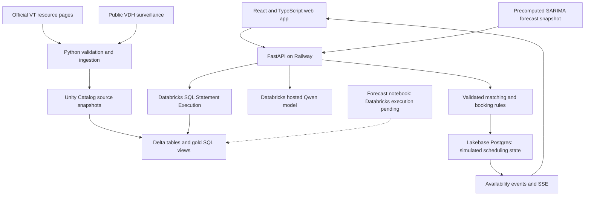

# HokieCare

**One request. One personal care navigator. One clear path to care.**

HokieCare brings campus care discovery, appointment coordination, and regional health intelligence into one application. Students describe the support they want and when they are available, compare relevant options, and explicitly confirm their chosen appointment. Healthcare professionals can explore sourced respiratory trends and prepare an editable briefing.

Built at **VTHacks 14** for the **Deloitte × Databricks** student experience and **Impiricus** healthcare-professional engagement challenges.

**[Open the live demo](https://vthacks-2026-production.up.railway.app)** · [Implementation evidence](docs/HANDOFF.md) · [Run locally](#run-locally)

> This is a working, independently developed hackathon prototype, not an official Virginia Tech service. Public health data and cited resource information are real. Appointment inventory and reservations simulate people creating and having appointments; they do not book care with actual providers.

## Why we built it

Finding care involves more than finding a provider's name. A student must understand which service fits, check eligibility and scheduling rules, navigate the relevant portal or phone process, and find a time that fits their life. HokieCare aims to make that journey easier while keeping the student in control.

VT's own reporting illustrates why access and coordination matter:

| Historical evidence | What it tells us |
| --- | --- |
| **4,349 clients and more than 25,000 Cook counseling sessions in 2017–2018** | Campus counseling already supported substantial demand. |
| **43% growth in students seeking Cook services from 2013–2014 to 2017–2018**, compared with **9.5% enrollment growth** | Service use grew faster than the student population. |
| Initial intake waits of **up to three weeks during fall semesters**, and **34% dissatisfaction with long waits** in the cited Healthy Minds Study responses | Access delays were a documented historical concern. |

These figures come from the **[March 2019 VT Mental Health Task Force report](https://students.vt.edu/content/students_vt_edu/en/about/reports/_jcr_content/content/vtcontainer_234021403/vtcontainer-content/download_1936365224/file.res/Mental%20Health%20Task%20Force%20Recommendation%20Report.pdf)**, printed pages 13 and 19. They motivate the project; they are not measurements of today's queues.

There has also been progress: VT's **[2024–2025 Student Affairs annual report](https://students.vt.edu/content/students_vt_edu/en/about/_jcr_content/nav-briefs/vtmultitab/vt-items_0/vtcontainer/vtcontainer-content/download_1364104811/file.res/2024-2025%20Annual%20Report.pdf)**, printed page 6, reports reduced waits between triage, intake, and the first counseling appointment, with an average **7.7 Cook sessions versus 5.7 nationally**. Our case for HokieCare builds on that progress. We have not measured current VT wait times or a reduction caused by our prototype.

### The navigation problem today

Students encounter different entry points and service rules. [Cook publishes a phone-based scheduling process](https://ucc.vt.edu/appointment.html), [Schiffert directs students to the Healthy Hokies Portal or phone](https://healthcenter.vt.edu/appointments.html), and [TimelyCare distinguishes scheduled counseling from on-demand TalkNow](https://ucc.vt.edu/timelycare.html). Cook individual therapy and TimelyCare scheduled therapy also have a concurrent-use restriction. Students must understand those differences before scheduling.

Our design addresses that navigation burden with one guided request, sourced explanations, comparable calendar choices, and an exact-time waitlist. The five-center appointment experience covers **Schiffert, Cook, TimelyCare, Carilion, and Hokie Wellness**. It demonstrates how coordination could work across those providers; their scheduling systems are not connected to our app.

## What we built

### Care Assistant and appointment coordination

1. **Describe the request.** Guided intake collects a name or alias, support needs, preferred center and modality, student eligibility, and a date/time window.
2. **Find relevant services.** A Databricks-hosted language model interprets the request using sourced service context. Backend rules validate service fit, preferences, eligibility constraints, and dates.
3. **Choose a time.** Matching stored calendar slots appear chronologically, with more choices available on demand. The student chooses the time rather than having the first result automatically booked.
4. **Review and confirm.** A separate review shows the exact service and time. Only explicit confirmation writes the reservation, after another availability and ownership check.
5. **Manage the appointment.** A private agenda supports cancellation, rescheduling, and calendar export. Shared calendars show anonymous availability changes across browser sessions.
6. **Join an exact-time waitlist.** Taken times can be saved to My waitlist. A cancellation makes an offer available to waiting users; required intake and explicit confirmation still apply. Competing confirmations can produce only one successful reservation.

The backend also retains the conversational assistant API for grounded answers and booking actions. The current landing experience uses guided intake. TalkNow is an on-demand resource, not a reservable calendar service.

### Health Intelligence for healthcare professionals

- Explore **350 weeks of New River district respiratory surveillance**, with Emergency Department and Urgent Care series, disease filters, charts, and an accessible table.
- Inspect source links, reporting dates, and data freshness alongside the results.
- Edit and export a sourced briefing/resource card. This uses a deterministic template; it is not an AI-generated clinical recommendation or an automatically sent message.
- View an **eight-week respiratory outlook** with 95% intervals and comparisons against simple forecasting baselines.

The forecast experiment uses SARIMA on regional respiratory-visit percentages. It does **not** predict individual illness, VT appointment demand, or no-shows. Its 30-week holdout evaluation was mixed: the seasonal baseline performed better for Emergency Department forecasts, and last week's value was best at the one-week horizon for both facilities. The API includes a precomputed snapshot generated from real data; the added Databricks notebook's MLflow logging and forecast-table writes remain unverified. See [forecast methods, results, and limitations](docs/FORECAST_SUMMARY.md).

### Official-provider handoff research

Official portal links remain available. An optional browser-companion preview was developed for Schiffert, and an authenticated feasibility test observed actual displayed availability. No real appointment was booked in that test. Installed-extension end-to-end booking and confirmed-provider-record import remain unfinished. See [companion documentation](companion/README.md) and [feasibility evidence](docs/SCHIFFERT_FEASIBILITY.md).

## Real data and simulated appointments

We built the public-data flow first, then added AI matching and persistent scheduling.

| Data | What we used | Role in the project |
| --- | --- | --- |
| VDH respiratory surveillance | **28,700 public aggregate records** in the imported snapshot | Real regional health evidence stored in Databricks. |
| New River subset | **700 observations: two facility series × 350 weeks**, January 4, 2020–September 12, 2026 | Trends, briefings, and forecasting. These are district observations, not VT student records. |
| Sourced resource directory | **Six curated records** with official URLs and verification metadata | Cook, TimelyCare scheduled counseling, TalkNow, Schiffert, Hokie Wellness, and SSD. This directory is distinct from the five-center scheduling catalog. |
| Academic scheduling simulation | Initial seed: **262 dates, 12,488 active slots, and 4,394 fictional reservations** for 250 synthetic owners | Simulates existing appointments and visitors creating, changing, or canceling appointments. These are seed-time counts, not current occupancy totals. |

**We used mock data to simulate real people creating and having appointments.** Fictional names and populated calendars let us demonstrate busy times, conflicting requests, cancellations, waitlist offers, and durable reservations without accessing private patient records. The application performs actual database transactions on that simulated inventory, and saved appointments survive application restarts.

Mock schedules and occupancy do not establish actual clinic hours, capacity, demand, no-show rates, or student behavior. The academic calendar provides a demonstration framework, not official provider closures. No reservation in HokieCare creates a real appointment at Schiffert, Cook, or another healthcare center.

The VDH snapshot retains **64 suppressed combined counts as null values with suppression flags**. We never turn those counts into zero or reconstruct them. Forecasting uses the published percentage series. Source geography, dates, and reuse caveats are retained in the [data feasibility notes](docs/HEALTHCARE_DATA_FEASIBILITY.md) and [import evidence](research/healthcare/databricks_import.json). The source is [VDH respiratory emergency-visit surveillance](https://www.vdh.virginia.gov/epidemiology/respiratory-diseases-in-virginia/data/emergency-visits-for-respiratory-illness/).

## Architecture



### Three implemented Databricks responsibilities

**1. Public data storage and analytics.** Python validates source records and writes immutable, hash-addressed snapshots to a project-owned Unity Catalog Volume and Delta tables in `workspace.hokiecare`. The `gold_service_directory` and `gold_new_river_trends` views serve the application through bounded backend queries. Provenance and suppression handling remain attached to the data.

**2. AI inference for navigation and matching.** We use the existing `databricks-qwen3-next-80b-a3b-instruct` hosted model rather than training a custom language model. It interprets requests and explains relevant services. Python validates model output against allowed services and retrieves actual stored demonstration slots. The model cannot invent valid slot IDs, execute arbitrary SQL, or directly commit appointments.

**3. Transactional appointment storage.** Databricks Lakebase Postgres stores sessions, slots, proposals, reservations, waitlist membership, and availability events. Transactions and interval-conflict checks protect against double booking and overlapping appointments. Idempotent requests make retries safe; rescheduling is atomic. Server-Sent Events, with polling recovery, refresh anonymous shared availability.

### Technology stack

| Layer | Technologies |
| --- | --- |
| Frontend | React, TypeScript, Vite, Tailwind CSS/custom CSS, Recharts, Lucide icons |
| API and application rules | Python 3.12, FastAPI, Pydantic, Uvicorn |
| Analytics and provenance | Databricks Unity Catalog, managed Volumes, Delta tables, SQL warehouse, Databricks Python SDK |
| Language model | Qwen3-Next-80B-A3B-Instruct through Databricks Model Serving |
| Scheduling persistence | Databricks Lakebase Postgres, Psycopg connection pooling; SQLite for local/test workflows |
| Forecast experiment | Python, statsmodels SARIMA, baseline comparisons; notebook prepared for MLflow and Delta output |
| Simulation | Reproducible Python/Faker calendar and fictional-reservation generation |
| Deployment and checks | Docker, Railway, GitHub Actions, pytest, Node test runner, TypeScript build checks |

The production Docker image serves the built frontend and API from one origin as a non-root process. Databricks credentials stay server-side, with a dedicated OAuth service principal for hosting. Developer authentication is separate from deployment authentication.

## Privacy and engineering safeguards

- Shared calendars and availability events expose busy/free state without publishing booking names or waitlist membership. Private records are bound to their owning browser session.
- The brief intake request is sent to the hosted model for inference but is not persisted in our application database, browser storage, or application logs. Booking names are excluded from model context. This is not a claim about the model provider's logging policy.
- Slot identity, version, ownership, expiry, and conflicts are rechecked before confirmation. Stale choices require a fresh review rather than silently substituting another appointment.
- The prototype uses browser-cookie ownership, not institutional login. Clearing cookies loses management access; durable identity and cross-device recovery are future work.
- The app provides navigation and coordination, not diagnosis. Regional forecasts are not campus outbreak declarations. Optional email and alert controls are interface demonstrations; they do not send notifications or subscribe users to a monitoring service.

## What would make this a campus-wide service?

**Connecting HokieCare to the actual campus healthcare centers is the next step toward widespread deployment.** That requires authorization and collaboration with Virginia Tech and each participating provider, rather than substituting simulated inventory for their schedules.

1. **Establish authorized integrations.** Agree on provider participation, permitted data access, scheduling interfaces, and operational ownership with each center.
2. **Replace simulated inventory with provider-backed availability.** Confirm booking, cancellation, rescheduling, and waitlist behavior against each provider's real system. A real appointment must have provider-issued confirmation.
3. **Add institutional identity and appropriate data controls.** Implement durable authentication, consent, access permissions, retention, auditing, and the privacy/security review required by the participating institutions.
4. **Pilot and measure.** Evaluate navigation completion, scheduling success, time to care, and canceled-slot reuse with authorized operational data and participating users.
5. **Validate predictive and notification features.** Run and monitor the forecast pipeline, assess usefulness across seasons, and design opt-in alerts with clinical and operational partners. No-show prediction, exam-week demand prediction, and automatic campus alerts are future concepts, not delivered capabilities.

The intended value is less effort for students to reach appropriate services and better visibility for providers. We have demonstrated the coordination workflow; we have not established measured improvements in real campus access, staffing utilization, or health outcomes. The architecture could later be adapted to other universities with their own provider agreements and service rules.

## Run locally

Use Python 3.12 and Node.js 24. An authorized Databricks workspace/profile is required for live directory queries and model inference; credentials and private data are not included in this repository.

```powershell
python -m venv .venv
.\.venv\Scripts\python.exe -m pip install -r requirements-dev.in
npm --prefix frontend ci
npm --prefix frontend run build

# Use your own authenticated Databricks CLI profile and permitted warehouse.
$env:DATABRICKS_CONFIG_PROFILE = '<your-profile>'
$env:DATABRICKS_WAREHOUSE_ID = '<your-warehouse-id>'
$env:HOKIECARE_COOKIE_SECURE = 'false' # Local HTTP only

.\.venv\Scripts\python.exe -m uvicorn hokiecare.app:app --app-dir backend --host 127.0.0.1 --port 8000 --no-access-log
```

Open `http://127.0.0.1:8000`. For frontend hot reload, run `npm --prefix frontend run dev` alongside the API. Local booking defaults to SQLite; production uses Lakebase. Export configuration explicitly: `.env.example` is a reference and is not automatically loaded. See [operations](docs/OPERATIONS.md) and [Lakebase/calendar setup](docs/CALENDAR_BOOKING_IMPLEMENTATION.md) for full environment and deployment requirements.

```powershell
.\.venv\Scripts\python.exe -m pytest -q
npm --prefix frontend test
npm --prefix frontend run build
```

## Verification and project guide

Recorded release checks cover real Databricks public-data reads and model responses, Lakebase persistence, two-user booking conflicts, ownership isolation, retries, cancellation/rescheduling, exact-time waitlists, and desktop/mobile UI flows. GitHub Actions checks the application and Linux container. These establish prototype behavior, not real-provider integration; dated evidence and per-release limits are in [HANDOFF.md](docs/HANDOFF.md).

| Location | Contents |
| --- | --- |
| [`frontend/`](frontend/) | Care Assistant, calendars, waitlist, and Health Intelligence UI |
| [`backend/hokiecare/`](backend/hokiecare/) | API, model orchestration, intake validation, transactional booking, and data access |
| [`scripts/`](scripts/) | Import, simulation seeding, deployment verification, and evaluation tools |
| [`notebooks/new_river_forecast.py`](notebooks/new_river_forecast.py) | Forecast modelling and proposed Databricks publication pipeline |
| [`data/contracts/`](data/contracts/) | Curated public-service records and data contracts |
| [`companion/`](companion/) | Optional Schiffert browser-companion preview |
| [`docs/WAITLIST_IMPLEMENTATION.md`](docs/WAITLIST_IMPLEMENTATION.md) | Exact-time waitlist design and operations |
| [`docs/CALENDAR_BOOKING_IMPLEMENTATION.md`](docs/CALENDAR_BOOKING_IMPLEMENTATION.md) | Shared calendars, transactions, events, and Lakebase persistence |
| [`docs/FORECAST_SUMMARY.md`](docs/FORECAST_SUMMARY.md) | Forecast evaluation and unfinished Databricks execution |
| [`docs/PROJECT_PLAN.md`](docs/PROJECT_PLAN.md) | Original requirements and project planning |

Some planning documents preserve earlier milestones. Use the latest handoff entries and current code when assessing what is implemented.

## Team and acknowledgments

Built by [sam044](https://github.com/sam044), [S-Gollu](https://github.com/S-Gollu), [cjf123x](https://github.com/cjf123x), and [andyshah17](https://github.com/andyshah17).

The project combines the team's application design, data pipeline, scheduling logic, integration work, and evaluation with public VT/VDH sources, open-source libraries, an existing hosted language model, and AI-assisted development tools. Source-specific reuse caveats are documented in the research notes. No private patient records, credentials, or API keys belong in the repository.
