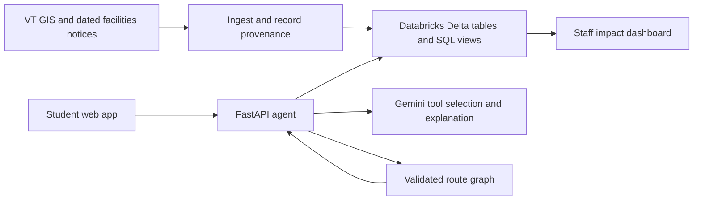

# Build and deployment plan

This is a proposed implementation plan, not a statement that the application exists. Following user feedback, the architecture and routing checks below are a **HokieAccess module reference**, not a decision to build the original standalone product. The current ExpoFlow and HokieHarvest architectures and four-minute demos are in [EXPANDED_IDEAS.md](EXPANDED_IDEAS.md). Choose one before implementation.

## Architecture

Use a React/TypeScript frontend, a Python FastAPI backend, a deterministic graph-routing library, and a map renderer selected after checking VT's GeoJSON and tile options. Build the frontend into the backend's container to keep one public service. Host on a small Vultr VM with Docker and an HTTPS reverse proxy. Pin dependency versions when scaffolding begins.

### Databricks is part of the actual product

1. Store source snapshots and fetch metadata in bronze tables.
2. Normalize buildings, entrances, route segments, and notices in silver tables. Keep original IDs and source URLs.
3. Produce gold views for destination access summaries and scenario impact.
4. The API retrieves relevant records through the SQL Statement Execution API using bounded, parameterized queries. Do not execute arbitrary model-generated SQL.
5. Show one real application query and its provenance during judging. Include an ingestion notebook/job and SQL artifacts in the repo.

[Databricks SQL API](https://docs.databricks.com/aws/en/dev-tools/sql-execution-tutorial)

Suggested fields: `source_id`, `source_url`, `retrieved_at`, `published_at`, `effective_from`, `effective_to`, `verification_status`, `is_synthetic`. Use nullable dates where unknown; publication date alone does not establish a closure's current status.

### Agent behavior

The model selects tools for destination lookup, notice retrieval, and route calculation. Tool outputs include IDs, source URLs, and validity information. Backend checks the requested destination and constraints, computes the result, and checks the final structured response. If the data cannot support a route, return an explicit unavailable/unknown result plus the official map and support link. An untrusted webpage or notice cannot authorize new tool permissions.

The dashboard uses sample trips until real, consented data exists. Report measured algorithm results such as route length and reachable destinations. Do not describe samples as live student demand or claim reductions in missed classes.

## Work schedule

The user's updated requirements set submission at **September 20, 8:00 a.m. ET**, superseding the earlier online deadline for our planning. Recheck remaining time before implementation and compress the blocks below. Reserve the last hours for verification and a four-minute presentation; target submission by 7:00 a.m. ET.

| Block | Deliverable and gate |
| --- | --- |
| First 2 hours | Choose flagship, authenticate Databricks/Genie, verify required data and deploy a health page. No dependency on obtaining campus Wi-Fi admin access. |
| Next 6 hours | First complete flow: participant/operator input → app state → Databricks ingestion → Genie answer → visible result. |
| Next 6 hours | Complete the selected queue/recruiter or dining scenario workflow, with data provenance. |
| Next 4 hours | Add the small HokieAccess venue-map integration; distinguish campus GIS from any sample indoor layout. |
| Next 4 hours | Polish phone/keyboard UX, verify permissions and failure handling, rehearse live inputs. |
| Only if time remains | Add one sponsor extension after the core works. |
| Final reserved hours | Freeze features, verify public HTTPS and source repo, record demo, enter every chosen track and contributor, submit by 7:00 a.m. ET. |

## Verification that matters

- Routes never cross a closed or unsupported edge; a disconnected graph returns no route.
- Unknown floor access, slope, or operational state is not silently treated as confirmed accessible.
- Date filters handle expired, future, and unresolved notices.
- Source IDs and citations correspond to actual retrieved records.
- Bad model output, rate limits, SQL timeouts, and Databricks quota exhaustion fail clearly.
- Keyboard and phone layouts work; map information also has a text representation.
- Credentials remain server-side. Admin/scenario mutation endpoints require authorization or operate only in an isolated demo sandbox.
- Public HTTPS page and health endpoints work outside the developer machine, and the service survives a container restart.

## Deployment and judging

Provision after account access is ready. Build the container, bind the app behind the reverse proxy, expose only required ports, configure secrets, restart behavior, and a health endpoint. Start with a provider hostname if HTTPS can be provisioned there; otherwise configure the controlled domain. Store deployment instructions and verified live URL in the repo. Confirm the public demo can be reached without a Databricks login.

Keep a dated, labeled snapshot mode and a short recorded demo for internet/API failure. A snapshot demonstrates the fallback; it must not be presented as a live Databricks query.

Use the selected four-minute story in EXPANDED_IDEAS.md. The full team must be present during its assigned slot in the Sunday 10:30 a.m.–1:00 p.m. ET judging window. Make the repository publicly accessible before submission, after checking tracked content for secrets and private records.
