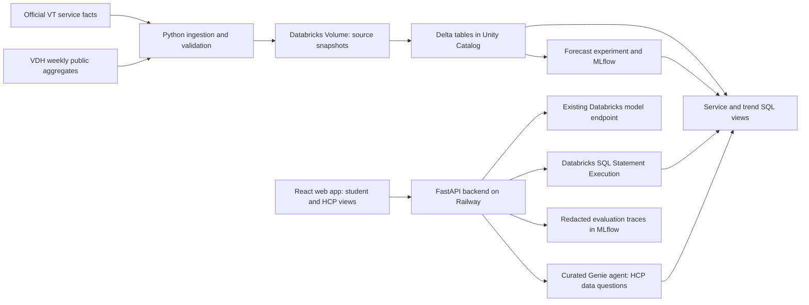

# HokieCare implementation plan

**Current implementation:** [Appointment/navigation milestone](BOOKING_IMPLEMENTATION.md) and [authenticated Schiffert feasibility](SCHIFFERT_FEASIBILITY.md) supersede the older planning-only appointment status below. Cook demo persistence and the Databricks navigation agent are implemented; Schiffert availability was observed live, while final booking remains user-controlled and unverified for automation.

**Latest appointment direction:** [Unified appointment hub](APPOINTMENT_HUB_PLAN.md) specifies the five-center experience, empty request/reservation store, student calendar, and scheduler queue. Use it for scheduling scope, persistence, connection capabilities, and delivery order; use the evolution plan for the broader agent and award strategy. No new booking feature is implemented by these planning updates.

**Next-build update (September 19):** [Prototype evolution and award strategy](PROTOTYPE_EVOLUTION_PLAN.md) is the current delivery plan based on the working repository, `message2.txt`, and the user's revised sponsor requirements. Prioritize a frontend tool-using agent and the HCP workflow, then a clearly labeled scheduling sandbox. Genie and forecasting are conditional enhancements. The original architecture below remains a reference; later historical statements about missing imports/deployment are superseded by the implementation update and handoff.

**Implementation update (September 19):** the first core import and public browser/API read flow are deployed and verified on Railway. [Deployment evidence](DEPLOYMENT_VALIDATION.md), [operations](OPERATIONS.md) and [handoff](HANDOFF.md) track actual delivery. The original roadmap below remains the design reference; the first-release API uses fixed bounded SQL and validates/filters parameters over small results. It does not accept arbitrary SQL. AI generation/curated Genie/forecasting remain later milestones.

Updated September 19, 2026. The user has authorized beginning the build, starting with this architecture, setup, and implementation plan. Deloitte × Databricks and Impiricus remain the primary prize targets. [Submission requirements](PROJECT_PLAN.md#requirements) remain authoritative: September 20, 8:00 a.m. ET, with a 7:00 a.m. submission target.

## Product decision

Build **HokieCare: campus care navigation and local health intelligence**. One web app has two complementary experiences:

- **Find care:** a student describes a service need or preference, sees relevant VT options, understands eligibility/modality constraints, and follows the official appointment link.
- **HCP briefing:** a healthcare professional selects a topic and sees a sourced New River respiratory trend briefing, relevant campus resources, and an editable resource card for student conversations. Preview/export is user-initiated; the prototype does not contact clinicians or students.

The first complete example is: "I want to explore evening counseling options" → sourced VT service cards and the Cook/TimelyCare concurrent-therapy constraint. The professional example is: "Show recent New River respiratory trends and campus resources relevant to a student-facing briefing" → dated chart, clearly defined change, source citations and a draft resource card. Mental-health navigation and respiratory surveillance remain distinct data domains; neither is evidence for the other's demand.

This scope uses the data we have. It does not rely on private appointment feeds, claim live availability, diagnose a student, or infer a VT no-show rate. [Data feasibility and limitations](HEALTHCARE_DATA_FEASIBILITY.md).

## First implementation milestone

**Load real data into Databricks and prove one complete read path before building a large interface.**

1. Use the user-selected `sam` workspace and inspect create/read privileges in its existing `workspace` catalog.
2. Create the proposed `workspace.hokiecare` schema and a managed source-snapshot Volume, after confirming the names do not conflict with existing resources. Leave other schemas alone.
3. Import two core sources: the real VDH snapshot and six curated VT service/appointment pages, with source URLs, reporting dates and verification metadata. Curate factual service summaries; do not mirror entire VT websites.
4. Produce a New River trend view and a verified service-directory view. Check full/source row counts, the 700-row New River subset for the pinned snapshot, date ranges, duplicates and suppression handling.
5. Implement `/api/services` and `/api/trends` using parameterized, bounded Databricks SQL queries. Show one service result and one small chart in the browser, with sources and freshness.
6. Prove hosted-backend authentication and publish the first thin HTTPS version. Only after these reads work do we add conversational generation and forecasting.

**Pass condition:** a browser result can be traced to an actual successful Databricks query over our imported source records. Local data loading, a screenshot, an endpoint listed as READY, or a static fixture alone does not pass this milestone.

## Architecture and stack



| Layer | Choice | Reason |
| --- | --- | --- |
| Frontend | React + TypeScript + Vite; Tailwind CSS; Recharts | Fast, polished mobile UI, explicit types, accessible chart/table alternatives |
| Backend | Python 3.12, FastAPI, Pydantic | One language for ingestion, analytics, model evaluation and API validation |
| Public hosting | One Docker container on Railway; FastAPI serves the built React assets | One origin and deployment; judges can open the public app without a workspace account |
| Data | Unity Catalog managed Volume + Delta tables + SQL views | Databricks owns the actual data lineage and serving queries |
| Transformations | Versioned Python/SQL, initially manual notebook/job execution; one Lakeflow Job when stable | Reproducible import without making a streaming pipeline a prerequisite |
| Databricks access | Modern CLI and Python SDK; SQL Statement Execution API | Existing OAuth works locally; one supported authentication/query path |
| Student agent | A small backend tool loop calling an existing Databricks Foundation Model endpoint | Uses explicit tools and real results; no separate model-provider signup initially |
| HCP data agent | One curated Genie agent over bounded gold views | A native Databricks agent with inspectable data questions and results |
| Forecasting | pandas + scikit-learn; MLflow experiments in Databricks | A compact, measurable extension using the local district time series |
| Validation | pytest for data/API contracts; Playwright for complete browser flows | Checks the failures that would break judging, rather than mirroring implementation |

Exact package versions will be resolved and locked when the app is scaffolded. We will not guess a current framework release from memory. MLflow tracing/evaluation APIs will follow the installed skills and the runtime's actual supported versions.

The public web runtime is a deliberate external-hosting choice. Databricks Apps is useful for internal workspace-authenticated tools; it is not an additional required deployment for this MVP. The installed AppKit skills remain available if an internal companion becomes worthwhile. [Databricks Apps](https://docs.databricks.com/aws/en/dev-tools/databricks-apps/) · [Railway FastAPI deployment](https://docs.railway.com/guides/fastapi).

### Keep the initial stack small

No MongoDB, Postgres/Lakebase, Redis, Kafka, external vector database, Databricks Connect, GPU training environment, or separate LLM vendor is required initially. Analytical data stays in Databricks. HCP topic selections, draft edits and saved comparisons are session-local in the demo; no patient records or durable account system is needed.

A small directory can use deterministic filters/text retrieval. Add semantic search only if evaluation exposes a real retrieval problem. CER and NHS remain optional external benchmarks; they are not renamed as VT clinics or used to fabricate campus demand. Preserve HokieAccess/GIS as a later navigation module.

## Data model

Proposed namespace: `workspace.hokiecare`. These are designs, not existing deployed objects.

| Object | Grain / important fields | First release |
| --- | --- | --- |
| `source_manifest` | source ID, URL, retrieved/reporting times, hash, license/access note, dataset version | Required |
| `bronze_vdh_respiratory` | original published aggregate row plus snapshot ID | Required |
| `silver_respiratory_weekly` | snapshot + geography level/name + facility type + week; typed percentages/counts; suppression flags | Required |
| `silver_services` | service ID, audience, topic, modality, access steps, official URL, constraints, verified date | Required |
| `gold_new_river_trends` | week/facility series with explicit units, comparisons and source/report dates | Required |
| `gold_service_directory` | approved service facts and public handoff links | Required |
| `gold_forecast_backtests` | target/week, prediction, baseline, model/version, split and error | After first deployed flow |
| `gold_forecast_latest` | district target, issue/as-of week, horizon, method and uncertainty metadata | Conditional on validation |
| `silver_calendar`, `silver_weather`, `silver_providers` | dated calendar events, weather samples/history, verified provider shortlist | Later enrichment |

Core rules: `*` is suppressed, never zero; district and region totals overlap; percentages and counts are different measures; the district is not VT; latest report date is not necessarily the latest event week. Preserve snapshot versions and use a validated current-snapshot view instead of double-counting refreshes. Never reconstruct suppressed counts from percentages. Do not sum disease columns to invent a combined metric.

Initial sources are already downloaded locally. VDH's API route works; its direct CSV route returned 403. If workspace outbound access is restricted, upload the locally retrieved snapshot through the Files API into a Volume. This is a supported ingestion design, not an assumption that notebooks can fetch every public URL.

## Agent and interface contracts

### Student experience

Use a short input with optional topic/modality/preferences, result cards and one visible next step. Avoid an empty chat-only landing page. Tools:

- `find_services(topic, modality)` returns approved directory records and constraints.
- `get_service_details(service_id)` returns the cited facts and verification timestamp.
- `get_official_handoff(service_id)` returns an allowlisted official URL; the browser chooses whether to open it.

The backend validates arguments and output. The model cannot invent services, URLs, current appointment times, or eligibility. A source page is data, not permission to execute instructions. Handle ambiguous service needs with a concise clarification; provide published emergency-support links for urgent/crisis requests without performing clinical assessment. The student flow does not accept uploads of medical records.

### HCP experience

Show a briefing page with topic selectors, an observed weekly line chart, explicit metric/period labels, and an editable resource card. A professional can inspect sources and ask a scoped data question. The suggested card is a draft, not an official VT or clinician-endorsed message.

Genie is restricted to public-data gold views with documented dimensions and sample questions. Display its SQL/results in an optional evidence panel. Use its built-in execution results; do not take generated SQL and rerun it with broader privileges. Student-facing endpoints use our bounded queries rather than arbitrary model-generated SQL.

Numeric statements come from query results; qualitative suggestions are labeled as suggestions. Include source/report date, geography and unknowns. The view switch is a demo experience selector, not an authentication boundary: both experiences contain public information only. No private admin functionality is exposed through it.

### Reliability and data handling

Use query timeouts, row limits, bounded conversation length, rate limits and short-lived caches for repeat public queries. Show distinct live-query, cached-snapshot, loading, empty, error and stale states. Never silently replace a failed live request with fake success. Cold warehouse starts need a useful pending state and a warm-up check before judging.

Production telemetry records request timing, source IDs and tool status; do not log free-form student health questions by default. Use team-authored non-identifying cases for MLflow evaluation traces. Raw CER health records stay out of the public app and repository.

## Forecasting after the core flow

Target: next-week **New River emergency-department respiratory-visit percentage**, not student infection risk, a campus outbreak declaration, or a staffing prescription.

Start with last-week and seasonal baselines. Evaluate a small regression model with lagged values, trailing statistics and calendar seasonality. Fit transforms inside each training split; never random-split time series or use future weather/labels. Reserve a final chronological holdout and use rolling validation. Report MAE in percentage points, coverage and baseline comparison in MLflow. Investigate early-period completeness, unusual values and historical revisions before fitting.

Display a model forecast only if evaluation supports it; otherwise retain the named baseline or observed trends. Historical as-of snapshots were not obtained, so a backtest on revised data must disclose that limitation. A prediction interval requires its own coverage check; do not turn model variance into an invented confidence band. Weather and exam dates are optional enrichment, not assumed causes.

## Delivery order and time boxes

These are working estimates, not promises. Recompute against the submission deadline before each major stage. The build has roughly one day available; the final hours belong to validation and submission.

| Order | Approximate effort | Concrete exit condition |
| --- | --- | --- |
| 0. Access/tooling | First hour | Selected workspace, working SDK/SQL/model smoke checks; hosting access and unattended OAuth path identified |
| 1. Data foundation | 2–3 hours | Validated core tables and two working queries; repeatable import |
| 2. Thin public app | 2–3 hours | Public HTTPS service/directory and trend pages backed by real Databricks reads |
| 3. Student and HCP agents | 3–4 hours | Cited navigation, editable briefing card, one scoped Genie conversation, defined failure handling |
| 4. One forecasting experiment | 2–3 hours, conditional | Time-based evaluation logged with baselines; optional forecast view |
| 5. Polish and verification | 3 hours | Mobile/keyboard checks, meaningful API/browser tests, rate-limit and timeout behavior |
| 6. Submission | Reserve at least 2 hours | Four-minute story, sponsor-specific HCP pitch if needed, public repo and working links |

Deploy early. At a time squeeze, cut provider/weather enrichment, GIS routing and the forecast UI before cutting correct sources, actual Databricks integration, the professional workflow, and public access. Do not spend the hackathon provisioning unrelated services just because skills exist for them.

## Account and access plan

**Databricks is already connected.** The user explicitly selected `sam`; CLI OAuth identity and metadata requests succeeded. A serverless warehouse, `workspace` catalog and ready model endpoints exist. A query, inference call, object creation, Genie availability and hosted service-principal access still need individual verification. A valid CLI login is not proof of all these permissions. [Verified setup](DATABRICKS_SETUP.md).

**Railway is the only additional account expected for the core plan.** Sign in at [Railway](https://railway.com/) using GitHub and allow access to `sam044/vthacks-2026` when connecting it. The account owner handles any billing prompt. No Railway project has been created or payment entered in this planning step.

The hosted backend should use a dedicated Databricks service principal with OAuth M2M, access only to the required views/warehouse/model/Genie resources, and credentials stored in hosting secrets. Establish this in the first deployment check; do not copy the developer's OAuth refresh-token cache to a server. If the workspace edition/admin permissions cannot support the required hosted identity, resolve sponsor/trial workspace access early. A personal token is not the default workaround. [Databricks OAuth M2M](https://docs.databricks.com/aws/en/dev-tools/auth/oauth-m2m).

Existing GitHub collaborators can follow this repo. Databricks workspace membership is separate and has not been verified for teammates. They do not need workspace accounts just to open the public demo. All four still need Devpost accounts. No paid dataset signup is needed for the core imports; no Supabase, MongoDB, AWS account, or separate model API key is currently requested.

## Validation and judging evidence

- **Data:** schema/type/date checks; source/checksum matches; unique grain; suppression handling; stable refresh counts for a pinned snapshot; no district/region double count.
- **Agent:** about 20 curated navigation/data questions including ambiguity, stale data, conflicting service constraints, unsupported questions, and source-instruction injection. Verify factual grounding and tool limits; do not promise an accuracy percentage before testing.
- **API/UI:** valid service handoff, real trend query, HCP draft generation, keyboard/mobile flow, query timeout, model failure, and explicitly labeled cached mode.
- **Forecast:** held-out error against named baselines; timestamped experiment and caveat on revised history.
- **Deploy:** successful public HTTPS check from an unauthenticated browser, health check, container restart and server-side credential review.
- **Deloitte evidence:** source → transformation → Delta/SQL → actual agent query → visible citation and lineage.
- **Impiricus evidence:** a professional actively uses a relevant briefing and edits/exports a resource card; distinguish this from a student chatbot alone. No measured HCP engagement or care-access improvement is claimed without a study.

## Planned repository structure

```text
frontend/                 React app, styles, charts, browser tests
backend/hokiecare/         FastAPI routes, validated tools, provider adapters
data/contracts/           Table schemas and curated public service facts
databricks/notebooks/     Source import, cleanup and forecast experiment
databricks/sql/           Core tables/views and parameterized query definitions
evals/                    Team-authored questions, expectations and model metrics
tests/                    Data and API integration checks
Dockerfile                Frontend build plus backend runtime
databricks.yml            Reproducible project jobs/resources after validation
.agents/                  Pinned official Databricks skills and notices
```

Only planning, research probes, skill files and setup metadata exist at this point. The proposed application directories/resources above have not been scaffolded or deployed. The next implementation action is the small Databricks data-and-query milestone.
